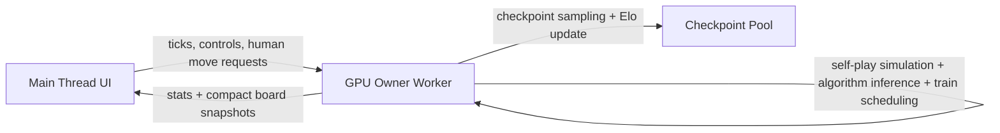
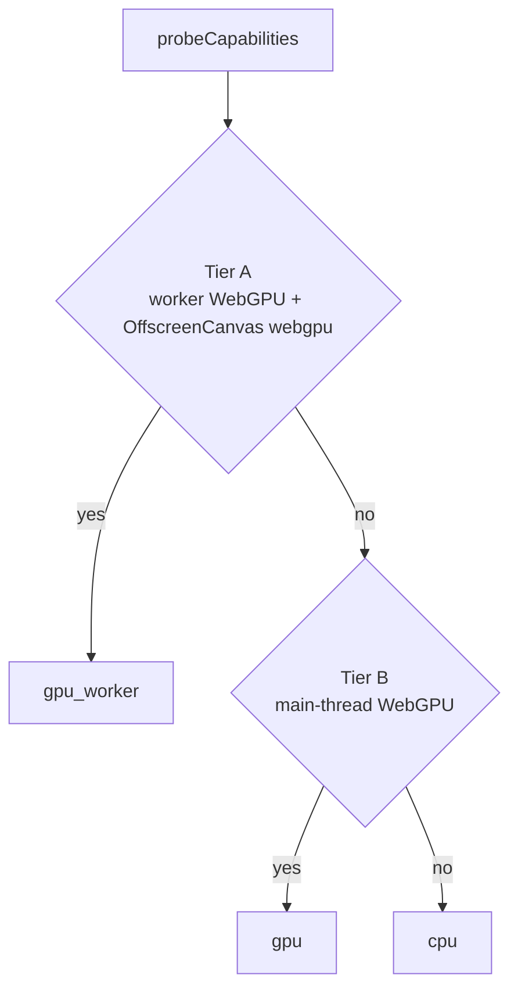

# Next-Gen Final Architecture

Date: 2026-03-04
Status: Executed (Scoped + 3 Runtime Modular Rework)

## Scope
This architecture is intentionally scoped to completion without scope growth:
1. Worker-first GPU runtime (`gpu_worker`) integrated.
2. Capability-tier startup selection (`A/B/C/D`) with safe fallback.
3. Async human-vs-AI inference through worker pipeline.
4. League-compatible checkpoint/Elo behavior.
5. Benchmarking artifacts (browser + Node WebGPU).
6. Modular runtime registry for the 3 production runtime modes.

## Runtime Modes (Shipped)
Runtime selection is now modular and registry-driven in `src/runtime/runtime_registry.js`.

1. `single_gpu_phased`
   - Single GPU owner worker, phased train/infer cadence.
   - Bounded queue depth + pause-during-train option.
2. `cpu_actors_gpu_learner`
   - CPU simulation actors + learner-side model updates.
   - Stable baseline topology with lower worker complexity.
3. `full_gpu_resident`
   - Aggressive GPU-owner worker scheduling.
   - Larger queue and frequent train scheduling for max throughput tuning.

Legacy aliases remain supported for compatibility:
1. `cpu` -> `cpu_actors_gpu_learner`
2. `gpu` -> `full_gpu_resident`
3. `gpu_worker` -> `single_gpu_phased`

## Runtime Topology

## Pipeline Selection

Selection policy is implemented in:
1. `src/nextgen/capability_probe.js`
2. `src/nextgen/runtime_planner.js`
3. `src/app.js` bootstrap

## System Paths

### 1) Training Tick
1. UI triggers `tick` budget.
2. Worker steps game batches.
3. Worker selects actions via selected algorithm.
4. Worker resolves terminals and updates replay/trajectory data.
5. Worker enqueues train jobs with dedupe.
6. Worker returns stats and periodic compact board snapshots.

### 2) Human-vs-AI
1. UI sends async action request (`state`, `mask`) to worker.
2. Worker runs `selectAction` on active algorithm.
3. Worker returns chosen action.
4. UI applies move and continues game flow.

### 3) Checkpoint / Elo
1. Checkpoints are saved by generation interval.
2. Opponent slots use stable checkpoint IDs.
3. Elo updates are sourced from league training games.
4. Async Elo eval path remains opt-in (off by default).

## Implemented Components

### Next-gen modules
1. `src/nextgen/protocol/messages.js`
2. `src/nextgen/workers/gpu_owner.worker.js`
3. `src/nextgen/runtime/gpu_owner_runtime.js`
4. `src/nextgen/gpu_worker_trainer_proxy.js`
5. `src/nextgen/create_gpu_worker_pipeline.js`

### Integration points
1. `src/app.js` pipeline creation + tier-aware startup
2. `src/ui.js` pipeline selector + async human action handling
3. `src/orchestration/gpu_orchestrator.js` async Elo eval opt-in flag
4. `src/runtime/runtime_registry.js` runtime mode registry + alias compatibility

## Performance Characteristics (Current)
1. Main-thread responsiveness improves by moving simulation/training orchestration into worker runtime.
2. Cross-thread payload size reduced by packing board snapshots to `Int8Array`.
3. Snapshot frequency reduced (`snapshotEveryTicks`) to lower transfer pressure.
4. Remaining bottleneck: `GPUGameEngine` still uses CPU readback (`dataSync`) internally, so the hot path is not yet zero-readback.

## Benchmarks Delivered
1. Browser benchmark page:
   `benchmarks/browser_webgpu_benchmark.html`
2. Node benchmark script:
   `benchmarks/node_webgpu_benchmark.mjs`
3. npm scripts:
   - `npm run bench:webgpu:browser`
   - `npm run bench:webgpu:node`

## Acceptance Criteria (This Pass)
- [x] Worker-first runtime integrated.
- [x] Capability-tier startup selection integrated.
- [x] Async human-vs-AI worker inference integrated.
- [x] Build passes.
- [x] Browser and Node benchmark artifacts created.
- [x] Implementation tracked in `docs/NEXTGEN_IMPLEMENTATION_PLAN.md`.
